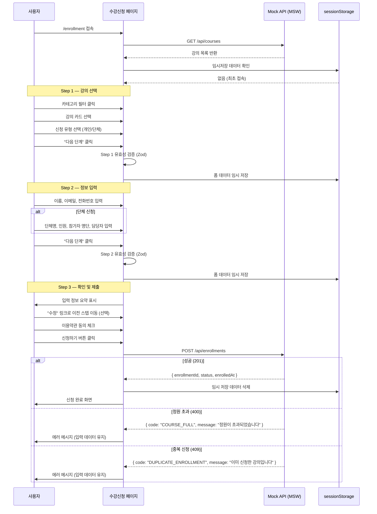
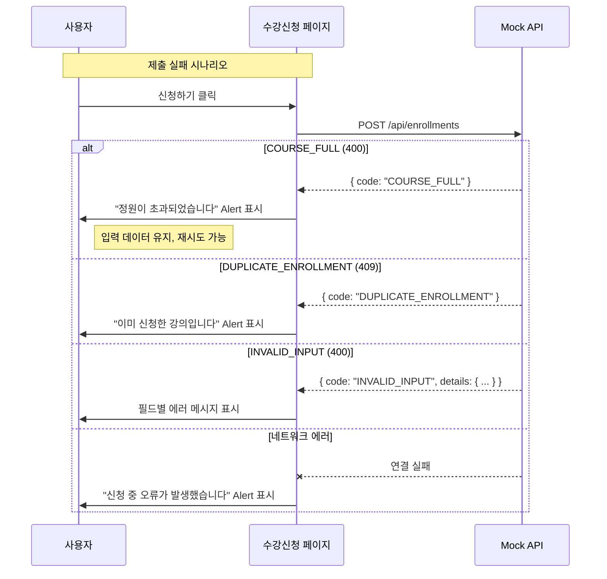
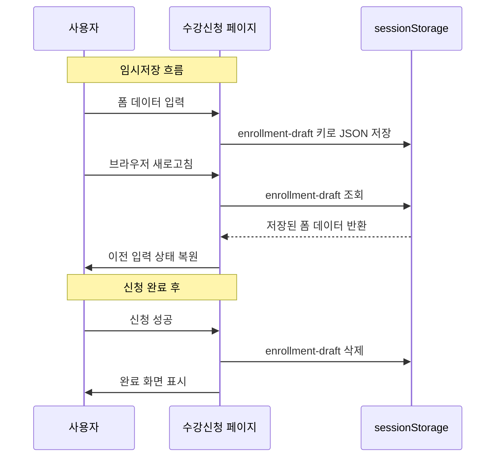

# 수강 신청 시퀀스 다이어그램

## 전체 흐름

## 테스트 시나리오 ↔ 다이어그램 매핑

| 시나리오 | 다이어그램 경로 | 테스트 파일 |
|---------|---------------|------------|
| 개인 신청 happy path | 전체 흐름 (alt 성공) | `enrollment-personal.spec.ts` |
| 단체 신청 happy path | Step 2 alt 단체 → alt 성공 | `enrollment-group.spec.ts` |
| 단계 이동 + 데이터 유지 | Step ↔ Step 역방향 화살표 | `enrollment-navigation.spec.ts` |
| 유효성 검증 실패 | P→P 유효성 검증 (실패 분기) | `enrollment-validation.spec.ts` |
| 정원 마감/임박 상태 | API 응답의 capacity 필드 | `enrollment-capacity.spec.ts` |
| 서버 에러 복구 | alt 정원초과 / 중복신청 | `enrollment-error-recovery.spec.ts` |
| 임시저장 복구 | SS ↔ P 복원 화살표 | `enrollment-draft-persistence.spec.ts` |

## 에러 응답 시퀀스

## 임시저장 시퀀스

